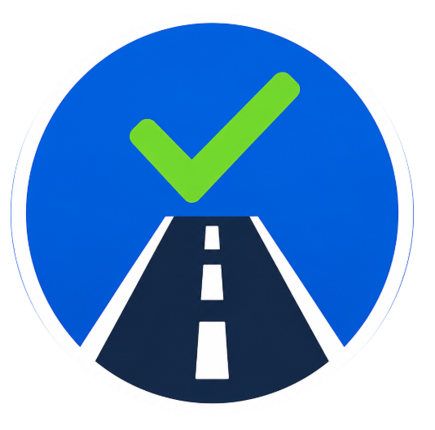

# LICENTEST

Examen teórico de conducción basado en la **Ley 109 · Código de Seguridad Vial** de Cuba.

  

## Características

- **546 preguntas** distribuidas en 7 libros del Código de Seguridad Vial + Glosario
- Exámenes aleatorios de 20 preguntas con 3 opciones cada una
- Sistema de puntuación: 5 pts por respuesta correcta, mínimo 70 pts para aprobar
- Retroalimentación detallada con respuestas correctas e incorrectas al finalizar
- Preguntas tipo combo que integran múltiples infracciones en un solo escenario
- Modo oscuro / claro
- Barra de progreso con indicador visual por pregunta
- Interfaz responsive optimizada para móvil con barra inferior tipo iOS
- Descarga directa de la Ley 109 en PDF

## Stack

- HTML + CSS + JavaScript vanilla (sin dependencias)
- Material Symbols (Google Fonts) para iconografía
- Desplegado en [Vercel](https://vercel.com)

## Uso

Abrir `index.html` en cualquier navegador o visitar:

**[https://licentest-cuba.vercel.app](https://licentest-cuba.vercel.app)**

Hacer clic en **Comenzar** para generar un examen aleatorio. Al finalizar, presionar **Evaluar** para ver los resultados.

## Licencia

Creado por **INTENAVE** — [yamir.herblay@gmail.com](mailto:yamir.herblay@gmail.com)
